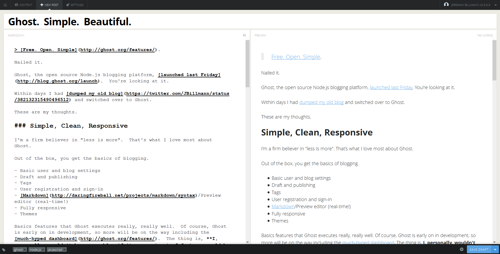

> [Free. Open. Simple](http://ghost.org/features/).

Nailed it.

[Ghost](http://ghost.org/), the open source Node.js blogging platform, [launched last Friday](http://blog.ghost.org/launch).  And you're a looking at it.

Within days I had [dumped my old blog](https://twitter.com/JBillmann/status/382132315490496512) and switched over to Ghost.  

These are my thoughts.

### Simple, Clean, Responsive

I'm a firm believer in "less is more".  That's what I love most about Ghost.  

Out of the box, you get the basics of blogging.

- Basic user and blog settings
- Draft and publishing
- Tags
- User registration and sign-in
- [Markdown](http://daringfireball.net/projects/markdown/syntax)/Preview editor (real-time!)
- Fully responsive
- Themes

Basic features that Ghost executes really, really well.  Of course, Ghost is early on in development, so more will be on the way including the [much-hyped dashboard](http://ghost.org/features/).  The thing is, **I, personally, wouldn't have a problem if its current set of features would be its last**.  Call me crazy, but I mean that sincerely.

My favorite feature is, of course, the Markdown editor that features a real-time preview as you type.  It is most certainly fancy, but it executes in such a welcoming manner.  The Ghost editor works very well, right down to the finer details.  Examples of this include an uber slick way of adding images to your posts and a quick Markdown reference guide.

>[The Best Writing Experience on The Web](http://ghost.org/features/)

I agree.

From here, you can save drafts, add tags, set the URL's and publish your posts.  That's it.  All of which is done thru a minimalistic, beautiful, and easy to use UI.

Ghost is fully responsive.  Call me hardcore, but I have actually edited a blog post on my smartphone - that speaks volumes to how responsive Ghost actually is.

It renders beautifully regardless of which device you throw at it.  I have a tough time deciding which is better eye candy: when it renders on my desktop browser or on my smartphone.  

Ghost has a [marketplace](http://marketplace.ghost.org/) where you can find different themes.  My personal favorite is the default theme that comes with it, and the one you're looking at - Casper.

All in all, I think Ghost looks great and delivers on its features and responsiveness.

Slight tangent here, but absolutely I love the login screen.  Yes, I just said that and I don't care what anybody says.  **This is the single best login screen I have ever seen.**  I just said that too and I'm still not listening.

> [Haters gonna hate.](http://www.kickstarter.com/projects/johnonolan/ghost-just-a-blogging-platform#project_faq_54801)

### Technology

[I'm a nerd, a software engineer](https://www.jbillmann.com/about/).  [I love JavaScript](https://www.jbillmann.com/jquery-goggles/).  [I love Node.js](https://www.jbillmann.com/introducing-garageserver-io/).  (You probably would've guessed me for a designer after I gushed about the Ghost UI.)

Ghost was developed with Node.js using [Express](http://expressjs.com/).

That automatically makes me biased, but oh well, at least I'm honest.

Out of the box, Ghost defaults to storing content in [SQLite3](https://github.com/orlandov/node-sqlite), but has a [MySQL](https://www.mysql.com/) option as well as support for [PostgreSQL](http://www.postgresql.org/).  I don't have much to say here other then, as expected, SQLite gets the job done in more places than one.  One little tidbit to note, is that under the covers, Ghost uses [Knex.js](http://knexjs.org/), a query builder, that currently only works with the three aforementioned databases.

Hosting options for Ghost are mostly limited to virtual private servers.  There are quite a few options, with reasonable prices and they've done a good job of [documenting how to install to them](http://www.howtoinstallghost.com/).

The hosting limitations shouldn't come as a surprise.  Node.js is young.  It is 4 years old, unlike the 18 year old adult, that is, Mr. PHP.  Node.js is certainly growing and hosting providers are becoming eager to adopt which will hopefully open many doors for shared, basic, Node.js hosting options.  

In the end, especially for the non-nerds, Ghost will be providing their own hosting.  As I see it, the current release is really meant for those who like to test and get nitty-gritty. 

### As for my blog...

**All that said, I currently have my blog hosted in [Azure Websites](http://www.windowsazure.com/en-us/develop/nodejs/)**.  This, in my opinion, is a big deal and users of the Ghost platform should take note.  Azure Websites offers simple, basic, shared hosting at a cheap price, heck [even a free as in beer option](http://www.windowsazure.com/en-us/pricing/details/web-sites/).

My next blog post (hopefully soon) will walk thru what is required to  get Ghost up and running with Azure Websites.  Presently, I've identified two key issues, mostly related to the absolute paths that Azure provides.  I've been working with members of the Ghost team to get these resolved and I hope to have more information in my next post.  It goes without saying, they are solvable as evidenced by way of my blog.

Lastly, Ghost will eventually offer plugin support.  Once the plugin API is ready, you can most certainly bet I'll do something by way of web sockets.

### In Closing

I love what I see with Ghost.  I've wanted to blog more and Ghost certainly fills a functional and technical gap that I had in the past.

I hope [O'Nolan](http://ghost.onolan.org/) and the rest of the Ghost team stick to the basics, they've done a hell of a job on delivering thus far.

> [Ghost is a platform dedicated to one thing: Publishing. It's beautifully designed, completely customiseable and completely Open Source. Ghost allows you to write and publish your own blog, giving you the tools to make it easy and even (gasp) fun to do. It's simple, elegant, and designed so that you can spend less time messing with making your blog work - and more time blogging](http://www.kickstarter.com/projects/johnonolan/ghost-just-a-blogging-platform).

I couldn't agree more.

Cheers!
