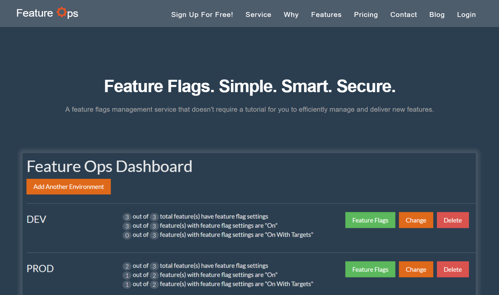
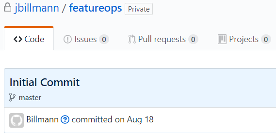
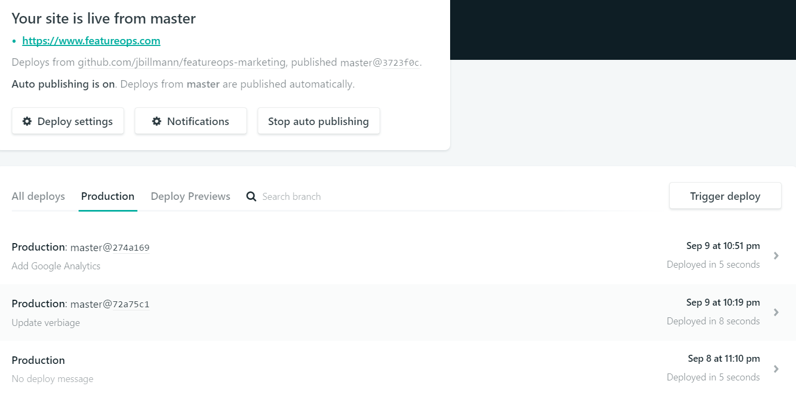

Recently I launched [Feature Ops, a feature flags (toggles) management service and API](https://www.featureops.com), and while you, as a reader, might not necessarily be interested in the service itself, I think you'll find the 21 day journey from nothing to something a tad bit interesting.

Of course, it all starts with an idea.

I have had many ideas over the years, but before committing to an idea this time around I decided on a set of criteria.  First off, the end application had to solve an established problem and, secondly, I had to be able to conceivably build the end service, in its entirety, without any outside assistance... in a reasonable amount of time.  The latter being especially important because of my day job which, of course, limits my development time to nights and weekends.

It goes without saying that I did not have intentions of launching 21 days after starting or keeping the initial capital to under $100, but that's how it worked out, and so it makes for great SEO.  So... I'll take it!  ;-)

Here is my 21 day journey (and beyond).

### August 18th (Days 1 - 16)
**It's all about the development.**

Without an application, nothing else mattered.  

My entire focal point during the first couple weeks was to get things done from an application standpoint.  Everyday, I re-prioritized the remaining features and set goals each night.  I had read [Rework](https://37signals.com/rework) 7 years ago and it left a lasting impression on me.  Specifically, I wanted to keep things stupid simple, I wanted to "underdo the competition" in a good way.  Each time I wanted to add a new feature, I would wage a mental chess game in my head to determine if I truly needed said feature.  More often than not, the feature was cut.

Technically speaking, I decided that whatever development toolset I would leverage, had to be free ([as in beer](https://meta.stackexchange.com/questions/21932/what-does-the-term-and-free-as-in-free-beer-mean)) and could *mostly* be done on a Windows PC or Mac.  Cosmos DB is an outlier here and, in choosing, I effectively committed to Azure hosting early on.

I decided on the following technology stack:

[React](https://facebook.github.io/react/):  free and open-source 
 JavaScript view library  
[Redux](http://redux.js.org/):  free and open-source JavaScript state management library    
[Bootstrap](http://getbootstrap.com/):  free and open-source responsive styling library  
[ASP.NET Core](https://www.microsoft.com/net/core): free and open-source web framework  
[Cosmos DB](https://azure.microsoft.com/en-us/services/cosmos-db/?&WT.srch=1&WT.mc_id=AID559320_SEM_TG6d75e6):  NoSQL database

[Visual Studio Code](https://code.visualstudio.com/): free and open-source IDE

I also had to send emails and take payments, so I opted to integrate with the following technology services:

[Stripe](https://stripe.com/): 2.9%  + 30 cents per transaction  
[SendGrid](https://sendgrid.com/): 100 emails/day free forever  

I actually bought the domain during this phase.  Ordinarly, I would recommend waiting, but my idea somewhat came to me in the form of a domain.  It happened to be available and I thought it was too good to let it slide.

[Namecheap Domain](https://www.namecheap.com/):  $10.87

**Money spent thus far:  $10.87**

### September 4th (Days 17 - 20)
**It's all about the marketing.**

The greatest of ideas will fail without proper marketing.

I knew this was going to be a challenge for me as I am a software engineer by day (obviously not a marketing position).  Here again, I wanted to keep things simple, so I opted for a single page marketing site.  I thought about building my own, but I began weighing cost and time and I decided it was in my best interest to buy given the low price of themed templates.

Additionally, I wanted to integrate with some type of marketing platform (mailing list) and so I opted for [MailChimp](https://mailchimp.com/) - free for up to 2,000 subscribers and 12,000 emails per month.

Finally, I knew I had to support email with regards to my custom domain.  Here again, I wanted to keep things simple, so I decided to leverage email forwarding to my Gmail account.  [Gmail also gives you the ability to send emails on behalf of a custom domain](https://jasonjensen.co/email/use-gmail-with-own-domain-free/).

I initially went with [ImprovMX](http://improvmx.com/) given that it is free and simple, but I found that its availability seemed to be inconsistent during my time with it.  This was an absolute no-go.  So, I instead switched to [ForwardMX](https://forwardmx.io/).  

[WrapBootstrap Theme](https://wrapbootstrap.com/theme/advent-multipurpose-landing-page-WB0LB7F49):  $16  
[ForwardMX](https://forwardmx.io/): $9

**Money spent thus far:  $35.87**

### September 8th (Day 21)
**It's all about the go-live.**

Leading up to this day, I knew there were some things that had to be done ahead of time so I could launch without any potential legal blockers.

[File LLC with the state](https://www.sos.state.co.us/biz/FileDoc.do): $50  
[Capital One Spark Business Bank Account](https://www.capitalone.com/small-business-bank/):  No fees or minimum balances  
[General Terms of Service & Privacy Policy](https://getterms.io/): $5

When it came time for hosting, I had to weigh options for the Feature Ops marketing site as well as the application site.

I had narrowed my search for the Feature Ops marketing site to [GitHub Pages](https://pages.github.com/) and [Netlify](https://www.netlify.com/).  I opted for the latter because SSL was a must and Netlify also offered simplistic and free integration with [Let's Encrypt](https://letsencrypt.org).

[Netlify](https://www.netlify.com/): Free for personal or commercial projects and free SSL

As for application hosting,  I had sort of known all along that I would go with [Azure](https://azure.microsoft.com).  I have had very favorable things to say about my experience with Azure.  (This blog is hosted on Azure with gives me an additional cost savings.)  I also have a lot of great history with Azure when I worked with the Azure Team and the Ghost Team to get [Ghost](https://ghost.org/) [up](https://www.jbillmann.com/installing-ghost-on-azure-web-sites/) and [running in the Azure gallery](https://www.jbillmann.com/installing-ghost-from-the-azure-web-site-gallery/).

[Azure App Service](https://azure.microsoft.com/en-us/services/app-service/):   Basic - 1 Core - $55.80/month  
[Azure Comsos DB](https://azure.microsoft.com/en-us/services/cosmos-db/):  1 GB & 400 RUs - $24.06/month  
[Namecheap SSL](https://www.namecheap.com/security/ssl-certificates/comodo/positivessl.aspx): $9  

Once I had launched, I spent hours upon hours of testing.  This testing extended well beyond the first day.  I knew that one misstep could cause unfavorable reviews and/or prevent users from actually *using* the system.  I used [Application Insights](https://azure.microsoft.com/en-us/services/application-insights/), which came along for the ride (for free) with my Azure hosting, to resolve any issues that arose with the application. This was the first time that I used Application Insights, but I will say that I was impressed with this offering.  It made tracking down and fixing issues much easier than had I not had it.

**Money spent thus far:  $99.87**

### Days 21 + *n*
**It's all about the SEO.**

At this point, I had launched the product in 21 days and under $100.  That's great and all, but let's get real, the toughest part is in the days and months ahead.

Knowing this, I have spent most of my recent time with Feature Ops attempting to improve SEO.  I figure that Feature Ops will likely succeed or fail in the hands of Google.

(Therein lies the main reason for this blog post. ;-)

I added Feature Ops to [Google Analytics](https://analytics.google.com), [Google Search Console](https://www.google.com/webmasters/tools), and [Bing Webmaster tools](https://www.bing.com/toolbox/webmaster).

This also meant writing blogs when [Introducing Feature Ops](https://www.featureops.com/blog/posts/introducing-feature-ops) as well as posting on Hacker News, Reddit, Product Hunt, and LinkedIn just to name a few.

I also realized that I may have made an SEO mistake when I opted for a single page marketing site given its small footprint.  So, I decided to [tack on a company blog to Feature Ops](https://www.featureops.com/blog/).  In this case, I opted for [Hugo](https://gohugo.io/) which played very well with my hosting on Netlify.

### Days of Past and Future
**It's all about the recurring costs.**

You may have noticed that I did not include the recurring costs in the running tally.  I did this because, up until this point, I have not actually paid for any recurring costs with the exception of GitHub that I have had for quite some time.  These payments will be coming soon, but to recap:

[Azure App Service](https://azure.microsoft.com/en-us/services/app-service/):   Basic - 1 Core - $55.80/month  
[Azure Comsos DB](https://azure.microsoft.com/en-us/services/cosmos-db/):  1 GB & 400 RUs - $24.06/month  
[GitHub](https://github.com/): 1 Personal Account - $7/month  
[Netlify](https://www.netlify.com/): Free for personal or commercial projects and free SSL  
[Stripe](https://stripe.com/): 2.9%  + 30 cents per transaction  
[SendGrid](https://sendgrid.com/): 100 emails/day free forever  
[MailChimp](https://mailchimp.com/) - free for up to 2,000 subscribers and 12,000 emails per month.  

(While I am pleased with my service with GitHub, I would recommend [GitLab](https://about.gitlab.com/) if you're looking to cut down on cost of having private repositories.)

Lastly, I recognize that as Feature Ops grows, my monthly recurring costs will likely change and additional decisions will have to be had.  All things considered, that sounds like a great problem to have given that it means my user base will have grown.

**Current monthly recurring costs:  $86.86**

### In Summary
I found myself thinking about things I never thought I would have thought about when attempting to launch a startup.  

Certainly cost and time was front and center during my work on Feature Ops, but they weren't necessarily a focal point or a driving reason behind *why I decided* to give it a try.

Looking back, I decided to write this blog post because, even though it took 21 days and $100 of initial capital, it also felt like a [choose your own adventure book](https://en.wikipedia.org/wiki/Choose_Your_Own_Adventure) with many decision points along the way.  Perhaps, all things considered, these decisions and what they amounted to might offer a decent amount of value for those who stumble upon this post...

And maybe, just maybe, it'll add some decent exposure and SEO to [Feature Ops - a feature flags (toggles) management service and API](https://www.featureops.com).