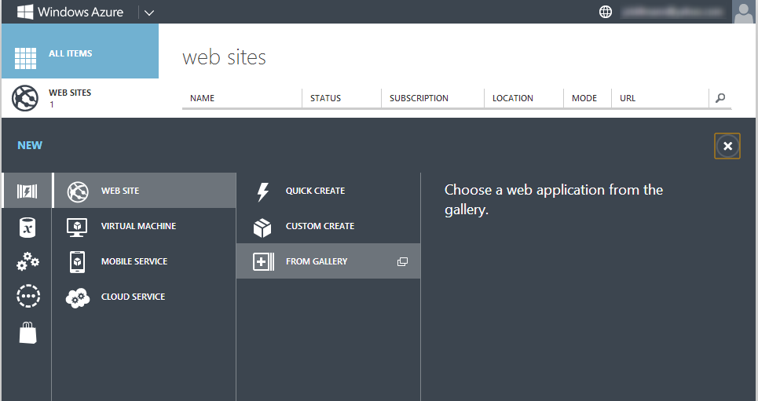
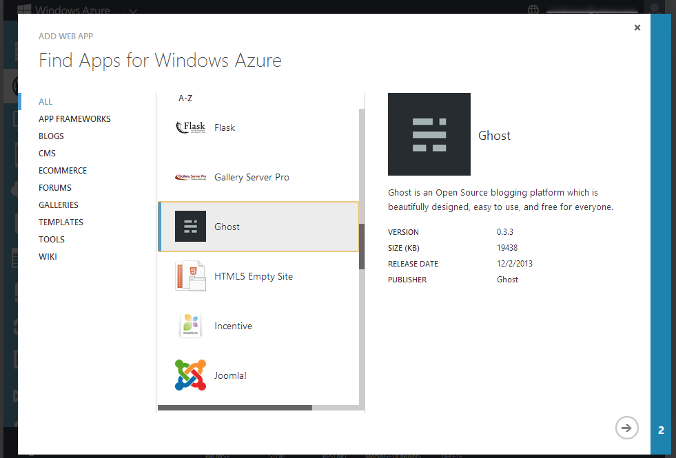
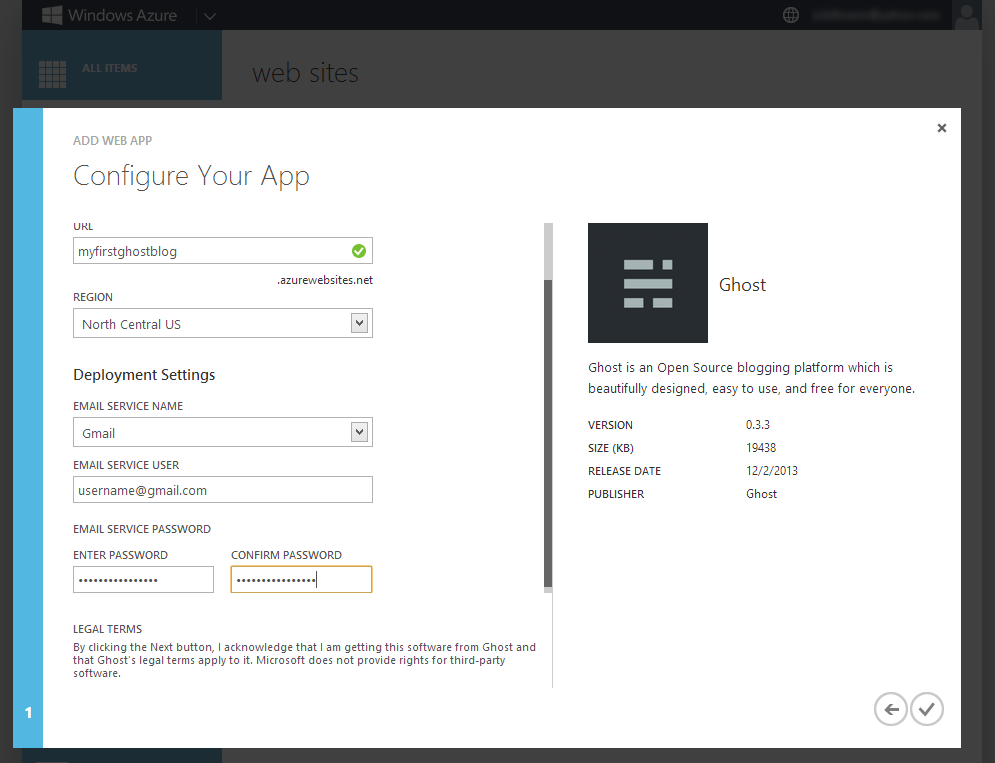
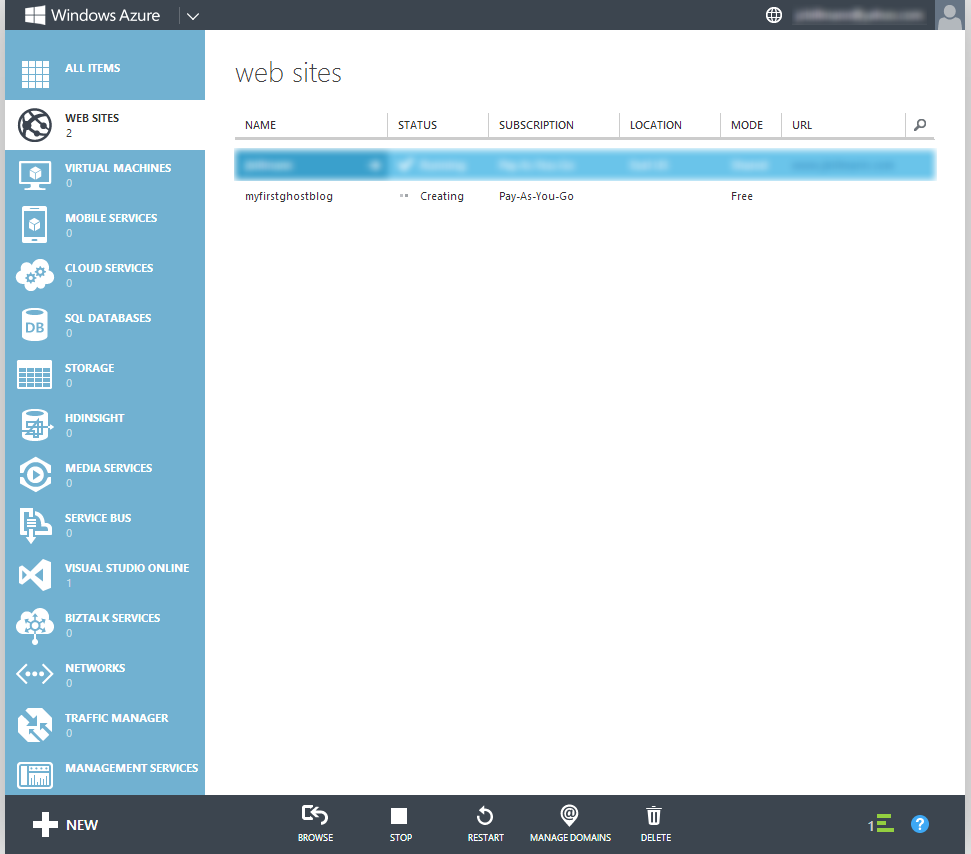
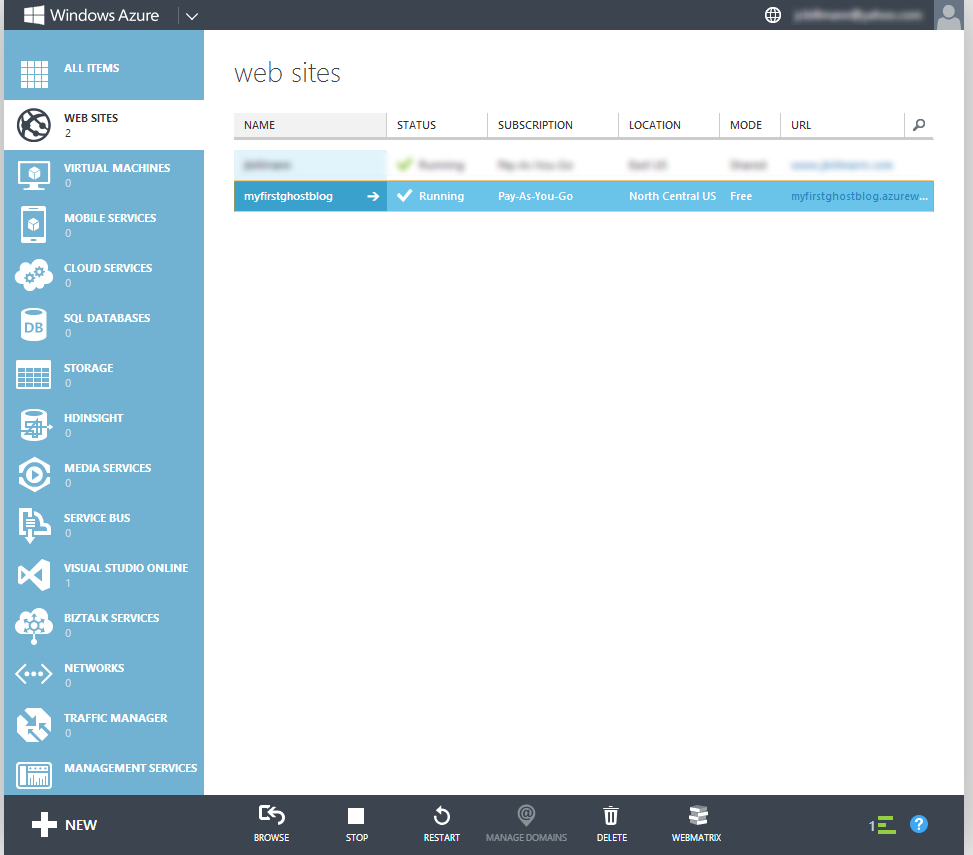
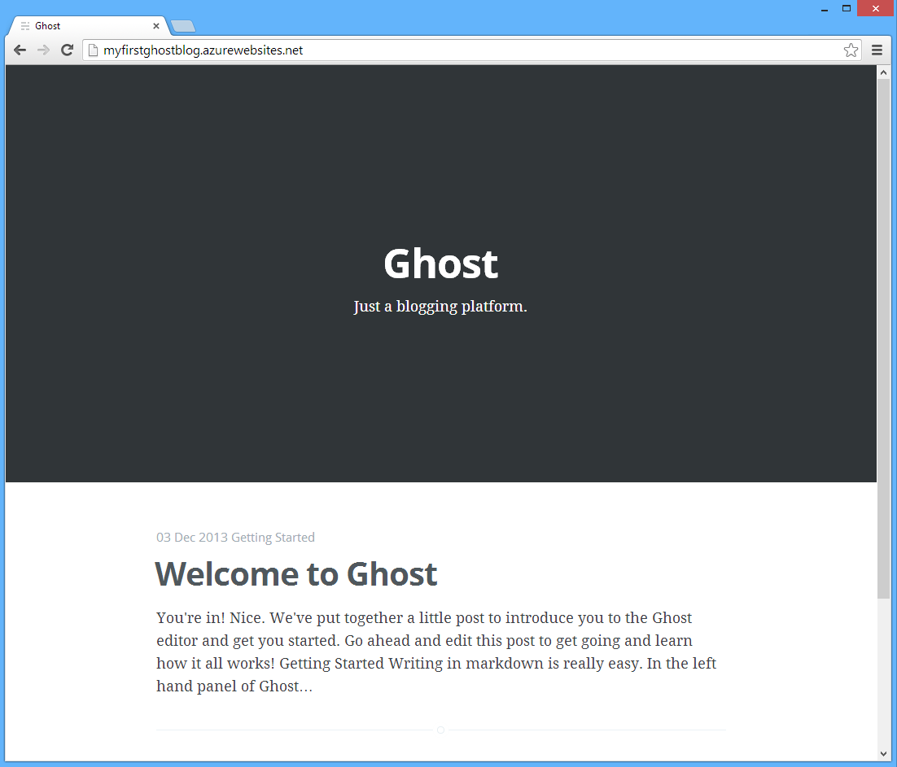
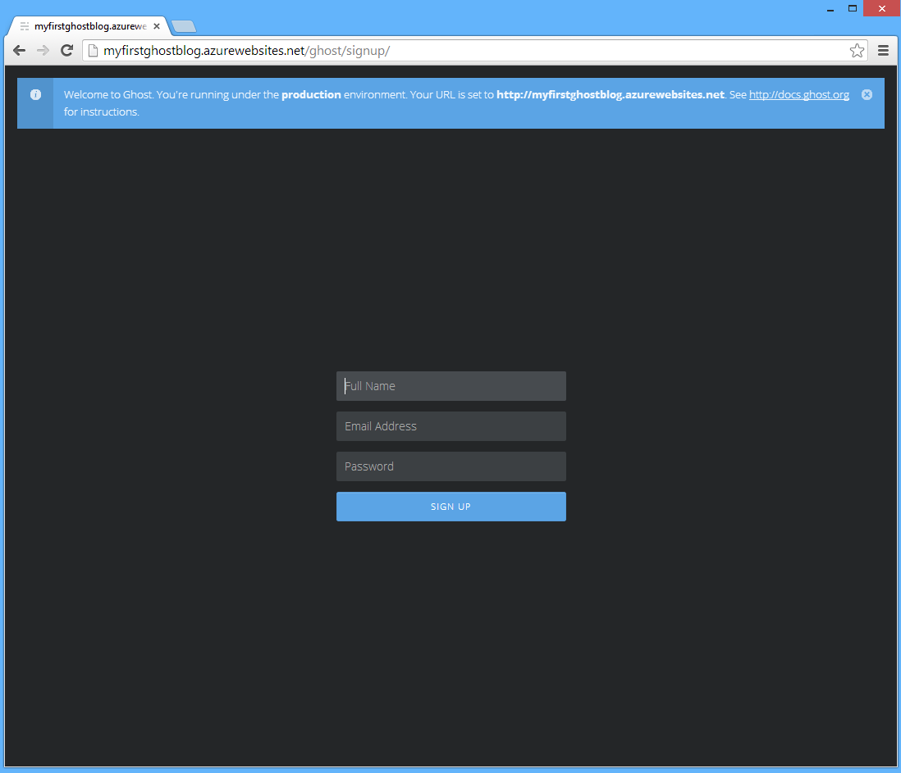

When [Ghost](https://ghost.org/) was first released to the public, I wrote a post on [how to install Ghost on Azure Web Sites](https://www.jbillmann.com/installing-ghost-on-azure-web-sites/).

Back then, I said:

> If you're looking for basic, simple, shared hosting for Ghost, then Azure Web Sites might be what you're looking for. They even have a free! as in beer option... and who doesn't love free beer?

Well, I'm happy to say that it gets even better than that!  

Ghost is now available via the [Azure Web Site Gallery](http://www.microsoft.com/web/gallery/)... and this means that installing Ghost on free, shared hosting could not be any easier!

It truly doesn't get any simpler than this, folks.

But don't take my word for it; let the screenshots below speak for themselves.

(Big thanks to [Glenn Block](http://codebetter.com/glennblock/), [Scott Hanselman](http://www.hanselman.com/) and [Sunitha Muthukrishna](https://twitter.com/mksuni) for helping the Ghost team make this happen!)

### Azure Web Site Gallery

You'll need an [Azure account](https://account.windowsazure.com/Home/Index), so if you don't already have one, go ahead and create one.  Once you're done with that, log into the [Azure Portal](https://manage.windowsazure.com/).

Add a new Web Site and select _From Gallery_.

Scroll down, select _Ghost_ and click the arrow.

Enter a _URL_, select a _Region_, select an _Email Service_, and enter the credentials.  I'm using Gmail in the screenshot below, but you can read about other email service options via the [Ghost Mail Configuration Docs](http://docs.ghost.org/mail/).  

Email is necessary in case you forget your Ghost password - a password reset will be sent to you.

(Side note:  This should get even easier with Ghost 0.4.0 - [no more email configuration](https://github.com/TryGhost/Ghost/issues/1538), hooray!)

It'll spin for a minute or two while it creates your shiny, new Ghost blog.

When it's done, a hyperlink will become available - click on it!

Your very first Ghost blog!  And free hosting!

What are you waiting for?! Sign-in and start blogging!

(You can access the sign-up via [yourghostazureurl].azurewebsites.net/ghost/signup).

Cheers!