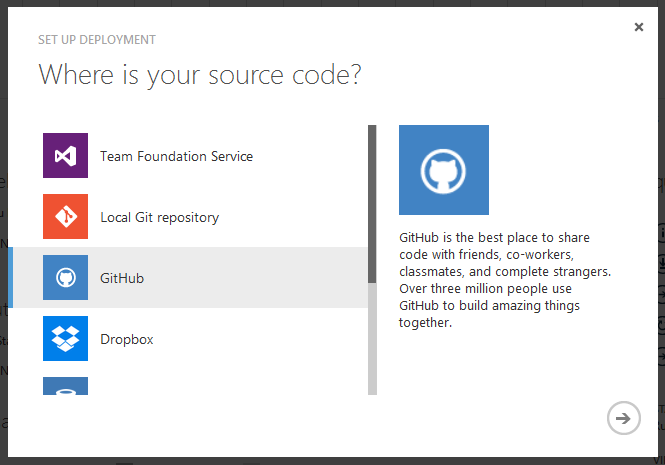
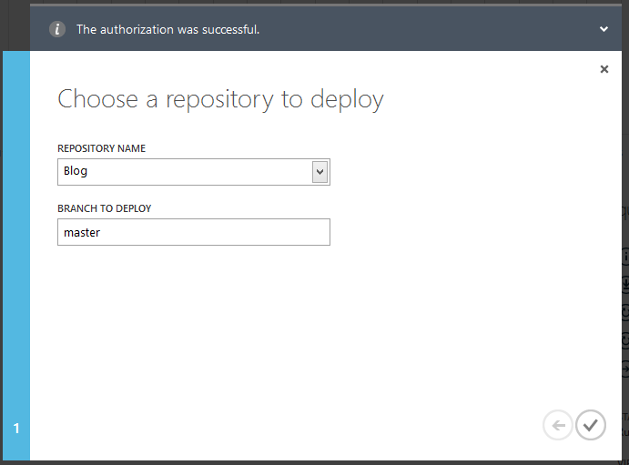
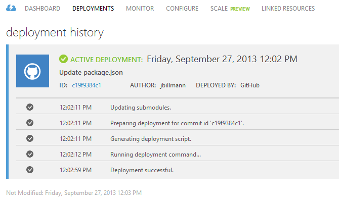
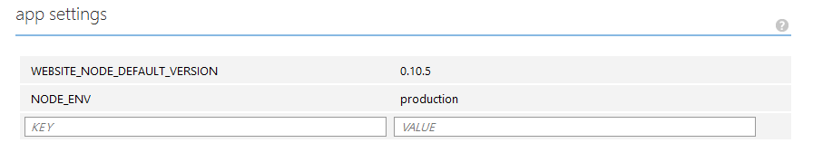

If you're looking for basic, simple, shared hosting for [Ghost](http://ghost.org), then [Azure Web Sites](http://www.windowsazure.com/en-us/solutions/web/) might be what you're looking for.  They even have a **free!** as in beer option... and who doesn't love free beer?  

I love beer.

I digress, let's get to it.

First and foremost, big thanks to [William Dibbern](https://twitter.com/gotdibbs) of the Ghost development team.  He and I worked together to solve the issues we saw with [Express](http://expressjs.com/) and [Express-hbs](https://github.com/gotdibbs/express-hbs) because of the Azure UNC paths.  He was always quick to respond and handled the dirty work of submitting issues and pull requests.  Thanks, William, we ought to have a beer together sometime.

That said, there are quite a few ways to get Ghost up and working with Azure.  This post will touch on the following two:

* GitHub
* Git
 
**Lastly, this post assumes you're using the SQLite option.  If you'd like to use MySQL, it's certainly an option with Azure, but this post does not cover the setup for that piece of it.**

You'll need an [Azure account](https://account.windowsazure.com/Home/Index), so if you don't already have one, go ahead and create one.  This, of course, will also require you to have a [Microsoft account](https://signup.live.com/), so if you don't already have one, go ahead and create one.

If you just signed up, welcome back.

### Create an Azure Web Site
First things first, let's create an Azure Web Site.  Login to the [Azure Portal](https://manage.windowsazure.com/).  Click on 'Web Sites' and 'New' at the bottom of the screen and select 'Quick Create'.  You'll be prompted to enter a URL or name for your web site.  This must be unique to Azure and your site will be accessible using the name you provide in the format of yoururlname.azurewebsites.net.  You'll still have the option, at any time, of choosing to use a [custom Azure domain](http://www.windowsazure.com/en-us/develop/net/common-tasks/custom-dns-web-site/). 


In under a minute, the web site should be created and you'll see the notification appear.  

The web site will be defaulted into 'Free' mode.  If you want a custom domain, you'll have to upgrade to 'Shared' mode.  [Pricing for Azure is reasonable](http://www.windowsazure.com/en-us/pricing/calculator/), and as of this writing, 'Shared' mode is under $10 per month.

From here, select the web site and enter into the dashboard.

### Configure Azure FTP

On the dashboard, click on 'Set up deployment credentials'.


You'll be prompted with a dialog to enter a user name and password.  You'll use these credentials when you FTP to the web site.  Store these somewhere.  Preferably somewhere secure.  You'll need them in a bit.

If you were to create multiple Azure Web Sites, you can use this same user name and password for FTP access across all of them.  

**When you FTP to your Azure Web Site, your user name will be in the following format:**

[AzureWebSiteUrlName]\\[UserName]

### Deployment from GitHub or Git

This step assumes you have your Ghost source code hosted in GitHub or a local Git repository.

Before you proceed with this step, do the following:

You'll have to bump the [Express](http://expressjs.com/) version in the <code>package.json</code> (found in the root of the Ghost source code) from <code>"express": "3.3.4"</code> to <code> "express": "3.4.0"</code>.  If you're reading this and the version is already <code>3.4.0</code> or greater, you have nothing to change.  This requirement is because of an [Azure bug in Express that was resolved](https://github.com/visionmedia/express/commit/9e406dfee22f172c084c900e235e1ac7e9497a24) in <code>3.4.0</code>.

#### Ghost configuration

If you haven't already done so, copy the Ghost configuration file, <code>config.example.js</code>, over to a new file named <code>config.js</code>.

You'll want to update the <code>production</code> property within <code>config.js</code>.  Swap out the value of <code>url</code> with the URL web site that you created.  You can copy that value from 'Site URL' under the dashboard of your web site.  Additionally, you'll want to set the port to <code>process.env.PORT</code>.  

[See the Ghost documenation for setting up email](http://docs.ghost.org/mail/).

Your <code>production</code> property should look something like this:

```js
production: {
    url: '[insert your Azure Web Site URL here]',
    mail: {},
    database: {
        client: 'sqlite3',
        connection: {
            filename: path.join(__dirname, '/content/data/ghost.db')
        },
        debug: false
    },
    server: {
        host: '127.0.0.1',
        port: process.env.PORT
    }
}
```

#### Initialize Ghost

Within the Ghost folder, install [Grunt](http://gruntjs.com/), <code>npm install -g grunt-cli</code>, bring in the Ghost dependencies via <code>npm install</code>, precompile the [Sass](http://sass-lang.com/) and [Handlebars](http://handlebarsjs.com/) via <code>grunt init</code> and finally minify the JavaScript with <code>grunt prod</code> -- all in that order.

Create a new file in the Ghost root called <code>server.js</code> and add this line of code to it: <code>var GhostServer = require('./index');</code>  This file is required for Azure Web Sites to detect that it is a Node.js application.

Commit all changes to your Git repository.  Note that the <code>.gitignore</code> will exclude <code>core\built\</code>, <code>core\client\assets\</code> and <code>config.js</code> files.  **These files are required**, so I'll leave it up to you if you wish to bypass and commit them or FTP them to your site after deployment.

#### Deployment
Next up, select 'Set up deployment from source control' on the Azure Web Site dashboard.

Here you can select 'GitHub' or 'Local Git repository'.  If you choose 'GitHub', keep reading otherwise use this [Azure Node.js Git tutorial](http://www.windowsazure.com/en-us/develop/nodejs/tutorials/create-a-website-%28mac%29/) and return to the **Azure Configuration** section below after the publish.



When you proceed, you'll be prompted to log into GitHub and accept the permissions that Azure is asking for.  Afterwards, you'll be prompted to select the repository containing your Ghost source code and the branch that you'd like to target.



Assuming success (GitHub or Git), you'll see something like this:



Note that Azure automatically processes the <code>package.json</code> and pulls down the submodules.  Lastly, as you make changes to your GitHub or Git repository, you can seamlessly sync those changes without having to run thru this blog post again.  Yay!

### Azure Configuration

Azure Web Sites have [iisnode](https://github.com/tjanczuk/iisnode) baked into the IIS pipeline.  It allows you to run Node.js applications within IIS.  If you love Node, you should say hello to iisnode - it has some [benefits](https://github.com/tjanczuk/iisnode/wiki#benefits).  I should probably blog about it - it's impressive in its own right.  Anyways, this works to our advantage because we don't have to install and/or setup Node.js on the Azure Web Site, it's just there waiting for us, in stealth, if need be.

#### Node.js environment variables

When Ghost runs, it reads from <code>config.js</code> to determine, for example, where to read/write data from.  Assuming a production environment, you'll want set the Node.js environment variable, <code>NODE_ENV</code>.

Click on the 'Configure' tab on your web site and scroll down till you see 'app settings'.  Add in <code>NODE_ENV</code> with a value of <code>production</code>.  Do not forget to click 'Save' at the bottom of the screen!



#### Azure web.config and iisnode.yml

Alright, it's time to FTP.  Grab the FTP credentials that you stored in a secure location earlier and open up your favorite FTP client.  Copy the FTP URL from your web site dashboard under 'FTP host name'.

Open up your FTP client, enter your credentials and connect to your Azure Web Site.

If you didn't already commit <code>core\built\</code>, <code>core\client\assets\</code> and <code>config.js</code> files to Git, now would be the time to FTP them.

This is completely optional, but you might be interested in logging your output and error streams.  You can do so by adding the following within the <code>/site/wwwroot/iisnode.yml</code> file:

```
loggingEnabled: true
devErrorsEnabled: true
logDirectory: iisnode
```

In this context, logs will be found under <code>/site/wwwroot/iisnode/</code> - you can change this to whatever makes you happy.
    
We're almost done!

### Hack for Azure UNC Support

_Update:  If you're using a version of Ghost that uses <code>express-hbs 0.5.0</code> this step is no longer needed.  Hooray!!_

~~This step is only required if, within the <code>package.json</code> of your Ghost source code, you are running <code>"express-hbs": "0.2.2"</code>.  The first release of Ghost, <code>0.3.0</code>, uses this version.~~

~~[An upcoming express-hbs fix should soon negate this step](https://github.com/barc/express-hbs/pull/19).  However, I have not tested it yet.  I'll be sure to do so when it's released.  Stay tuned to this blog for further information about this issue.~~

If you're new to Node, I don't condone what I'm about to show you.  If you're not new to Node, ummm, close your eyes, skip over the next section and spare me in the comments.

That said, there are other ways to do this, but a hack is a hack is a hack... and we all do it from time to time.

_Update:  The pull request above was not entirely complete.  If you are using Ghost containing <code>express-hbs 0.3.0</code>, replace <code>/site/wwwroot/node_modules/express-hbs/lib/hbs.js</code> _with [this hbs.js](https://raw.github.com/gotdibbs/express-hbs/2048e3f078dccd889de9f943afae4481af08cfdf/lib/hbs.js) from a [pull request](https://github.com/barc/express-hbs/pull/24) that will, hopefully, soon negate this hack all together.  If you are using a version of Ghost containing <code>express-hbs 0.2.2</code>, continue with the steps below._

Edit <code>/site/wwwroot/node_modules/express-hbs/lib/hbs.js</code>.

Swap out the <code>cachePartials()</code> function with the following.

```js
function cachePartials() {
    var files = fs.readdirSync(partialsDir);
    files.forEach(function (file) {
        var stats = fs.statSync(partialsDir + '/' + file);
        if (!stats.isFile()) return;
        var source = fs.readFileSync(partialsDir + '/' + file, 'utf8');
        var name = path.basename(partialsDir + '/' + file, path.extname(file));
        exports.handlebars.registerPartial(name, source);
    });
}
```

That's it.

That wasn't so bad, was it?  That said, please don't ever associate my name with the aforementioned.  Too late, eh?

In all seriousness, if you don't know any better, usually you want to avoid hacking your <code>node_modules</code>.  These are your project dependencies which are not typically stored with your application source code.  They are automatically pulled in based on your <code>package.json</code> via an <code>npm install</code>.

Instead, if possible, find a work-around in your application or submit a pull request to said module and begin using that version in your <code>package.json</code>.  (Says the guy who did neither... my options are limited and, while I'd love to help out, I'm not on the Ghost development team.)

### Conclusion

If you successfully followed my instructions, you can navigate to the URL of the web site you just created.  

Ghost, [simple, beautiful, blogging](https://www.jbillmann.com/ghost-simple-beautiful-blogging/), is ready for ya!

[Boom goes the dynamite](https://www.youtube.com/watch?v=W45DRy7M1no)!

(If you receive an error when navigating to the URL, try restarting the web site within the Azure Web Site Portal.)

Any questions, comments, concerns or free beer, please reach out to me via [Twitter](https://twitter.com/jbillmann) and/or the comments below.

Cheers!