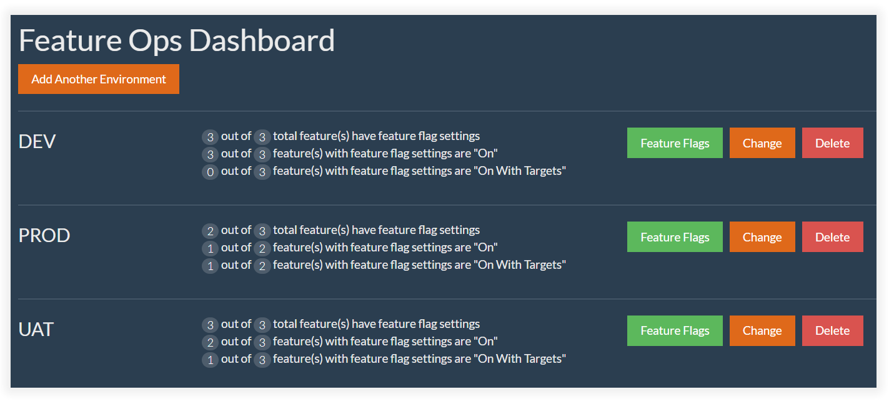
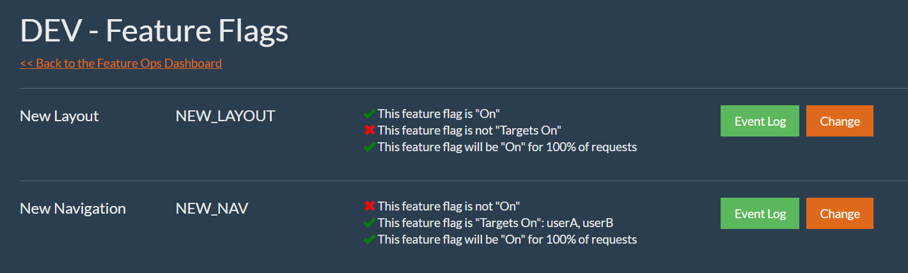

## Feature Flags

[Feature Flags (or Toggles)](https://martinfowler.com/articles/feature-toggles.html) are essentially glorified if/else statements in code that can be used to determine if a feature, at runtime, should be shown or hidden for end users.

>Feature toggles are a powerful technique, allowing teams to modify system behavior without changing code.

... but, if used properly, *they are oh-so much more*.

Over the past few years, I've been a part of projects that have had Continuous Delivery - short release cycles - and despite the relative success, it always amazed me how much time and effort went into *releasing code*.  Time and effort that greatly adds up with each release cycle:

1.  Branch and/or Merge the code.
2.  Test a version of the code.
3.  Prepare the users for a version of the code.
4.  Deploy a version of the code that unleashes feature fury on the users.

In terms of the end users, this approach is backwards.  It is *code-centric* rather than *feature-centric*.  Users don't care about the code.  All they care about are the features and *how* those features are released to them.

Therein lies the power of Feature Flags.

Feature Flags allow you to decouple your feature deployments from your code deployments.

The thought process is as follows:  Wrap new development in feature flags and continue to develop and release code (no need for code branching).  Releasing code then carries less of a risk and less of an impact to your end users because the act of releasing code is not directly tied to a release of new, potentially unstable, features - features that carry a functional and/or technical risk.  

Last, but certainly not least, use an administrative tool to toggle features on or off at your own choosing.  Perhaps you do so incrementally (I.e. 50% of the users) or with group targets (I.e. specific users).

Regardless, you are in control of rolling out and/or rolling back features thereby decoupling the feature deployments from the code deployments.  This leads to less time, effort, and risk when it comes to deployments as a whole.

## Introducing Feature Ops

Feature Flags, and the services that support them, are not anything new, but they have certainly gained a lot more traction with the of rise Continuous Integration and Continuous Delivery - DevOps as a whole.  My recent experiences with these delivery techniques had me researching the thought process behind Feature Flags which ultimately led myself towards the creation and development of Feature Ops.

### Feature Flags as a Service

[Feature Ops is a Feature Flags service](https://www.featureops.com).  It offers a management portal, easily accessed from desktop or mobile, that allows you to manage/change the status of your feature flags in your various environments.  

[Feature Ops exposes a secure RESTful API](https://app.featureops.com/apioverview) that allows your code, regardless of language, to know if a feature is 'on' or 'off' at runtime.

It's that simple.

In addition to all that, you can incrementally release features, target features, and view audit and statistical information on your features for each environment.

My goal with Feature Ops, especially when compared to the competitors, is to keep things simple, smart, secure, and affordable.  I want to deliver 100% of the features for the 80% of Feature Flag developers.

Feature Flags isn't complicated and your Feature Flags service doesn't have to be complicated, either.  Spend less time thinking about your Feature Flags service and more doing on how to best manage your features.

Check it out, you can [Sign Up for Feature Ops](https://app.featureops.com/signup) for free!