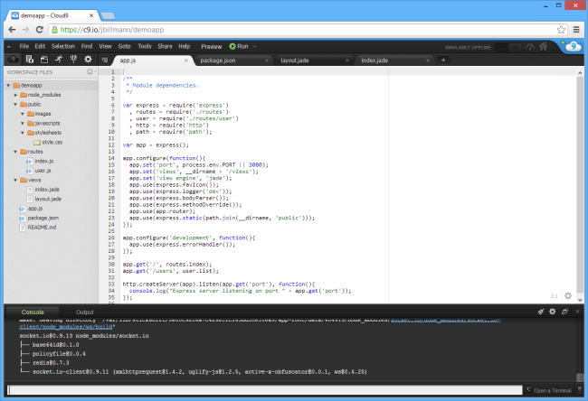

I admit it, I'm late to the [cloud party](https://twitter.com/JBillmann/status/299562967383564289). 

It was only this past week that I decided to fully embrace the cloud for all of my personal storage needs. 

While I might be lagging in certain aspects of the cloud, I was quicker to adapt in other areas of the cloud.  I've used [GitHub](https://github.com/) and [CodePlex](http://www.codeplex.com/) for my open source projects and the source code for this blog is hosted in the [TFS cloud](http://tfs.visualstudio.com/).  That's not really saying much and it probably leaves you wondering why I have source code in every pocket of every cloud.  I know, I'm going to have to try a lot harder if I want to be labeled as something of an early adopter of anything cloud-based.   So, let's talk cloud in one area that, dare I say, I intend on taking early advantage of.

Imagine what it'd be like if, as a developer, you did everything in the cloud?  I'm not just talking storing your source code there.  I'm suggesting that you would have your entire development environment in the cloud and your browser would be the gateway to getting things done.  No longer would there be a need to install anything, you'd simply be able to develop and publish anywhere and everywhere so long as you had access to a web browser.  Let that sink in for a moment.

That opportunity is already here and it's called [Cloud9](https://c9.io/).

### Cloud9

Granted, this opportunity is limited to web development, but as a mostly web developer, it's an opportunity that I plan to seize early.  Or, as my wife would say, it's an opportunity that I'll probably talk really loud about.  (Yes, the amount of decibels that I output increases with my level of excitement.)

Cloud9 is an IDE in the cloud and it supports web development.  You can sign-up and use it for free.

> Cloud9 IDE is an online development environment for Javascript and Node.js applications as well as HTML, CSS, PHP, Java, Ruby and 23 other languages.



But it does so much more than just that.  It offers version control support, integrated application deployments to your favorite hosts (Azure, Heroku, etc.), code-completion, collaboration, command-line and a [boatload of other cool features](https://c9.io/site/features/) that you can read for yourself.  Heck, the platform itself is even [open source](https://github.com/ajaxorg/cloud9/).

While Cloud9 offers support for over [30 different languages](https://docs.c9.io/supported_languages.html), it was designed with JavaScript in mind.  For those of you keeping score at home, you had to figure I was going somewhere with JavaScript. ;-)

### Node.js

Which brings us to [Node.js](http://nodejs.org/).

You may have heard some of my gripes about web development in the past - it mostly centered on having to know a markup language, a server language and a client language.  I've been mostly quiet on this when I started throwing JavaScript Kool-Aid all over the room, but it also became somewhat of a moot point when Node came about.

Cloud9 was built on and is tightly integrated with Node.  There is where Cloud9 really shines.  Not only do we have our JavaScript IDE in the cloud, but we also have Node readily available at all times too - just sitting there smiling right at you. 

How awesome is that?  Pretty awesome.

So as you might expect, when creating a project with Cloud9, Node is already there and so is the Node Package Manager.  Quite literally, I can create a new project in Cloud9 and with only a few statements in the command-line, I have application using Node, [Express](http://expressjs.com/) and [Jade](http://jade-lang.com/) ready to go.

```sh
npm install express
express
npm install
```

Everybody loves web sockets, so how about a dash of [Socket.IO](http://socket.io/)?

```sh
npm install socket.io
```

Nothing noteworthy in the aforementioned statements, just visually highlighting how easy all of this is done through the Cloud9 terminal seconds after a project is created.  By the way, you want Git or Mercurial access via that terminal?  No problem, it's there too.

### JavaScript Cloud

So what does all of this mean?

For me personally, and I'm sure many others, the combination of all this provides the perfect little storm.  Cloud9 offers somewhat of an end-to-end JavaScript developer's dream.  [Insert lame "on cloud nine" idiom here.] 

We have the ability to develop, collaborate, commit source code and publish via the cloud - all of which can literally be done right in the browser with Cloud9.  Even better is that anything and everything JavaScript is all bundled with it.  Node, NPM, CoffeeScript, TypeScript, LESS, etc. etc.  Integrated and ready for take off.

Our very own JavaScript Cloud.

This is the part of the cloud that I plan on being an early adopter of and it's also the perfect backdrop for my next JavaScript endeavor.  Stay tuned.

Cheers!