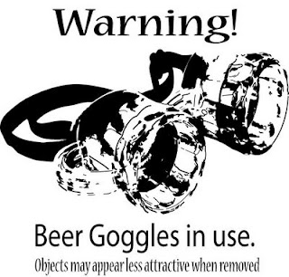

Recently, I spent quite a bit of time working with [vanilla JavaScript](http://vanilla-js.com/) during development of an HTML5 game. 

Prior to, much of my client-side scripting experience was done on line of business applications with small to large doses of jQuery, jQuery plug-ins, jQuery AJAX, jQuery this, jQuery that, etc., etc., etc.

So naturally, it was during development of this game that I decided it was time to fully embrace and deep dive into raw, vanilla JavaScript design, strategies and patterns.  Shortly thereafter, I face planted.

Let's rewind a bit...

> QUESTION:  Do you know JavaScript?

> NOT A GOOD ANSWER:  Yes, I've done a lot with jQuery.

I don't think I'm alone when I say that my first, major endeavors into client-side HTML scripting actually began within the realm of a certain JavaScript framework, namely jQuery.  It is because of this, that my world of JavaScript, or lack thereof, began to grow with tunnel vision.

Or as I like to call it, jQuery Goggles.



When wearing jQuery Goggles, you see a seemingly simple world composed of small script blocks, elegant selection and manipulation of DOM elements along with all that big, scary vanilla JavaScript (you know, the non-important stuff) hidden behind the scenes.  I know, I know, jQuery **_is_** JavaScript, but trust me when I say if you're wearing jQuery Goggles, jQuery **_is not_** JavaScript.

Fast forward to my HTML5 game...

My thought process was that I could leverage my jQuery experience to build an entire game using mostly, vanilla JavaScript.  In the words of Twitterers everywhere, #EpicFail.  It also didn't help that my day-to-day language happens to be an object-oriented, class-based language which is a far cry from that of a prototype-based language.

The challenge only made me hungrier.  I kept digging and learned about all sorts of [awesome things](http://www.addyosmani.com/resources/essentialjsdesignpatterns/book/) about JavaScript ranging from the [Module](http://www.adequatelygood.com/2010/3/JavaScript-Module-Pattern-In-Depth) [Pattern](http://briancray.com/posts/javascript-module-pattern/), [prototypes](http://elegantcode.com/2010/12/03/basic-javascript-part-3-prototypes/), [closures](http://lostechies.com/derekgreer/2012/02/17/javascript-closures-explained/) and [self-executing functions](http://elegantcode.com/2010/10/22/basic-javascript-part-1-functions/).  Truth be told, I had already seen all of these patterns and techniques throughout my jQuery experience, but ignorance is bliss with jQuery tunnel vision.  Before I knew it, the aforementioned big, scary JavaScript, was no more, rather it was an elegant language - a world far more beautiful than the one I had seen with those goggles on.

Soon, this:

```js
var counter = 0;
  
function incrementCounter() {
  counter++;
}

function getCounter() {
  return counter;
}
```

Became this: 

```js
var counterModule = (function(){
  var _counter = 0,

  increment = function() {
    _counter++;
  },

  get = function() {
    return _counter;
  };

  return {
    incrementCounter: increment,
    getCounter: get
  };
})();
```

Upon "completion" of the game, I found myself taking all of my newly formed skills and refactoring the entire game codebase.  It served no useful purpose to that of the game, but it at least provided confirmation to me that my long held JavaScript tunnel vision was finally gone.

Furthermore, and as I see it, truly understanding JavaScript is more important now then it ever has been.  I think one could make an argument that it is one of the most important languages to know at this moment in time - [even if you're not a web developer](http://msdn.microsoft.com/en-us/library/windows/apps/br211385.aspx).

I'm not saying that you should give up jQuery or [insert JavaScript framework here]. 

I'm simply saying that if you're wearing the jQuery Goggles, not only is it a good time to take them off, there's a world beneath, far more elegant than you may think.

Cheers!