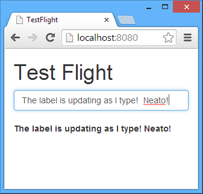

[Earlier this year](https://blog.twitter.com/2013/introducing-flight-web-application-framework), Twitter released [Flight, an event-driven web application framework](http://flightjs.github.io/).

Back then, [I remarked](https://twitter.com/JBillmann/status/297397591480598528):

> My thoughts on Twitter Flight: Simple, clean way of decoupling your JavaScript into pub/sub components, but I wonder about maintainability..

Only to never return to it.

I'm a sucker for all things _simple_, _decoupling_, and _JavaScript_, so it's rather surprising I didn't do anything more with it.  There was always something I liked about my initial review of Flight, so I finally had the urge to revisit.  

It also gave me a chance to use as many cheezy puns as possible with regards to airplanes... and who doesn't love airplanes?

### Flight

> Flight is a lightweight, component-based JavaScript framework that maps behavior to DOM nodes.

With Flight, you build components.

Think of these components as modules that wrap the behavior of your UI and/or data elements.  However, you don't handle these components directly.  Rather, components expose events and consume events from other components.  In other words, components do not talk to each other directly.  Components are completely decoupled and Flight handles the pub/sub communication between them.


Neat, eh?

In case you're wondering, [Flight does offer mixins](https://github.com/flightjs/flight/blob/master/doc/mixin_api.md) - shared functionality between components.

### Flight Generator

In this example, I'm opting to use the [Flight Generator](https://github.com/flightjs/generator-flight/) _to get off the ground, quickly_.  [Play Laugh Track]

Flight Generator allows you to generate application and component scaffolding for your Flight application - it requires Node.js and Git to be installed.  

I'm choosing to use Node here, but you could port these pieces of code to whatever web platform gives you the warm fuzzies.

First, install Flight Generator and generate the scaffolding for your <code>app-name</code>.

```sh
npm install -g generator-flight
mkdir flight-app && cd $_
yo flight <app-name>
```

We're going to keep things simple.

Let's create a simple 'application' that has a textbox and a label.  And, as you type in the textbox, it'll update the label.  I know, I know, I was wearing my creative cap today.

```sh
yo flight:component input
yo flight:component output
```

This will generate the scaffolding for two components that you'll find in <code>app/js/components</code>. That leaves us with the task of simply filling in the details.

### Components

Flight requires an [AMD](http://requirejs.org/docs/whyamd.html) implementation.  I prefer [require.js](http://requirejs.org/), but you may opt for something else.  When you create a module, you'll have to export a [Flight component module](https://github.com/flightjs/flight/blob/master/doc/component_api.md), <code>flight/lib/component</code>.  These components come with the baked-in, [basic functionality](https://github.com/flightjs/flight/blob/master/doc/base_api.md) and event handling that we're about to look at.  I want to emphasize that the components below are just scratching the surface when it comes to the [Flight API](https://github.com/flightjs/flight/tree/master/doc).  There's much more to discover, but this is just a blog post to get us out of the gate.

#### Input Component
<code>app/js/component/input.js</code>

Our input component will have the task of detecting a <code>keyup</code> event thereby triggering the <code>inputChange</code> event passing the current value of the binding node, <code>this.$node.val()</code>, to subscribers of the event (in our case, our output component).

```js
define(function (require) {
    'use strict';
    var defineComponent = require('flight/lib/component');
    return defineComponent(input);

    function input() {
      this.onKeyup = function () {
        this.trigger('inputChange', {
          val: this.$node.val()
        });
      };

      this.after('initialize', function () {
        this.on('keyup', this.onKeyup);
      });
    }
});    
```

#### Output Component
<code>app/js/component/output.js</code>

Our output component will have the task of detecting an <code>inputChange</code> event which will subsequently update the text of its binding node with the incoming value, <code>data.val</code>.  Unlike the input component, which was only listening for the <code>keyup</code> event from its binding node, the output component will listen for <code>inputChange</code> from any DOM element within <code>document</code>.

```js
define(function (require) {
  'use strict';

  var defineComponent = require('flight/lib/component');
  return defineComponent(output);

  function output() {
    this.onInputChange = function (e, data) {
      this.$node.text(data.val);
    };

    this.after('initialize', function () {
      this.on(document, 'inputChange', this.onInputChange);
    });
  }
});
```

#### Initialize Component
<code>app/js/page/default.js</code>

Our final piece of the puzzle is to bind, or <code>attachTo</code>, our components to DOM elements - also known as their binding node in the context of Flight.  You do so by specifying a <code>selector</code> and here we're using an <code>id</code> for both.

```js
define(function (require) {
  'use strict';

  var input = require('component/input'),
    output = require('component/output');

    return initialize;

  function initialize() {
    input.attachTo('#input');
    output.attachTo('#output');
  }
});
```

#### View
<code>app/index.html</code>

Modify <code>index.html</code> that is generated by the Flight Generator and add in the necessary DOM elements to get our example working.

```html
<div class="container">
  <h1>Test Flight</h1>
  <form role="form">
    <div class="form-group">
      <input id="input" type="text" class="form-control"/>
      <label id="output"><label>
    </div>
  </form>
</div>
```

#### Server
<code>app/app.js</code>

Finally, create an HTTP wrapper and <code>node app</code> it!

```js
var connect = require('connect');
connect.createServer(
    connect.static(__dirname)
).listen(8080);
```

I think it's alive!


    
### On Arrival

Twitter Flight is a simple framework that lives by [Separation of Concerns](https://en.wikipedia.org/wiki/Separation_of_concerns).  You build a component and bind it to a DOM element.  Components work independently of each other via publication and subscription to component events.  Flight doesn't attempt to do anything with routing, templating, rendering or kitchen sinking - and it's fine with that.

In a world filled with YAJMVL™ (Yet Another JavaScript MV Library - [Angular](http://www.angularjs.org/), [Backbone](http://backbonejs.org/), [Ember](http://emberjs.com/) and [Knockout](http://knockoutjs.com/), etc.), Twitter Flight offers _something_ of an alternative.

If you like simple, decoupling, JavaScript and vanilla ice cream - I think you might find Flight to be an attractive alternative.

Cheers!